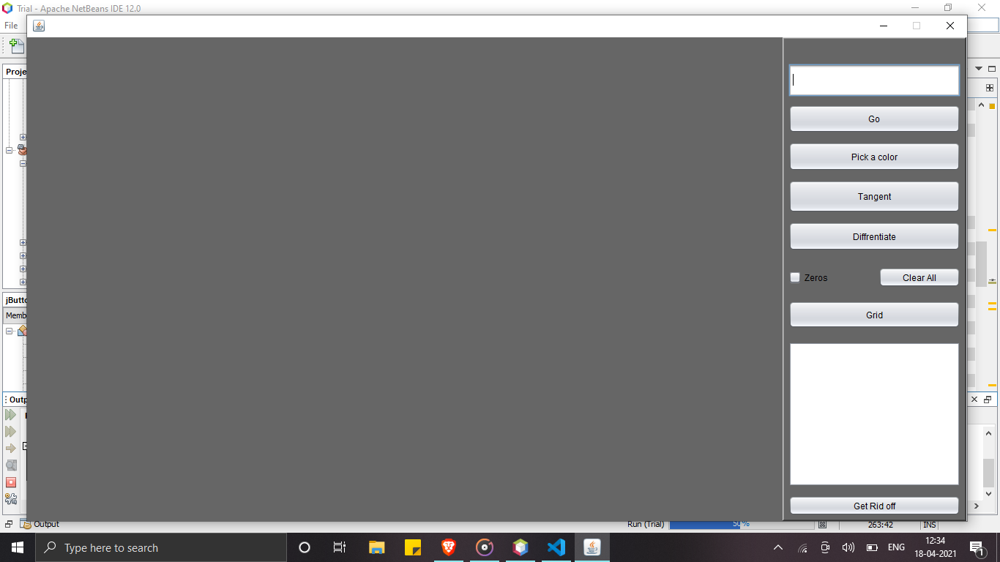
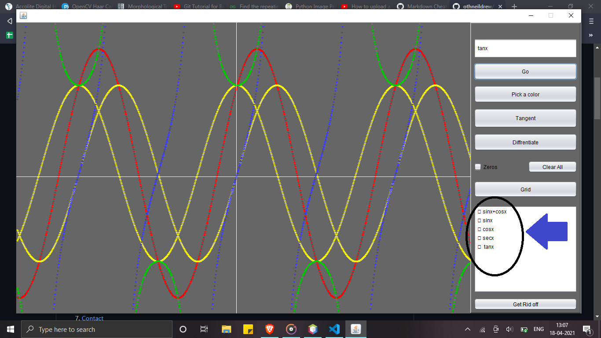
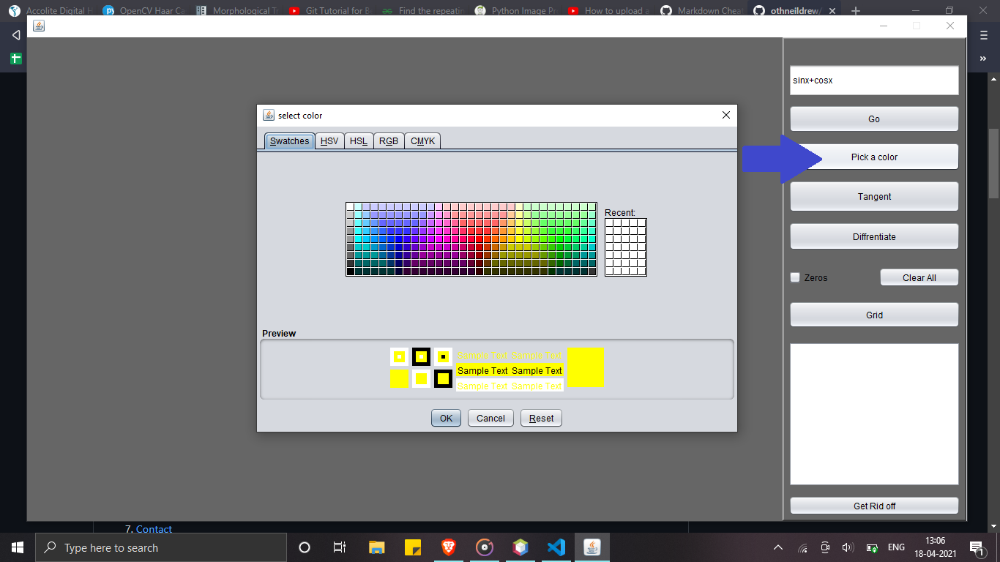
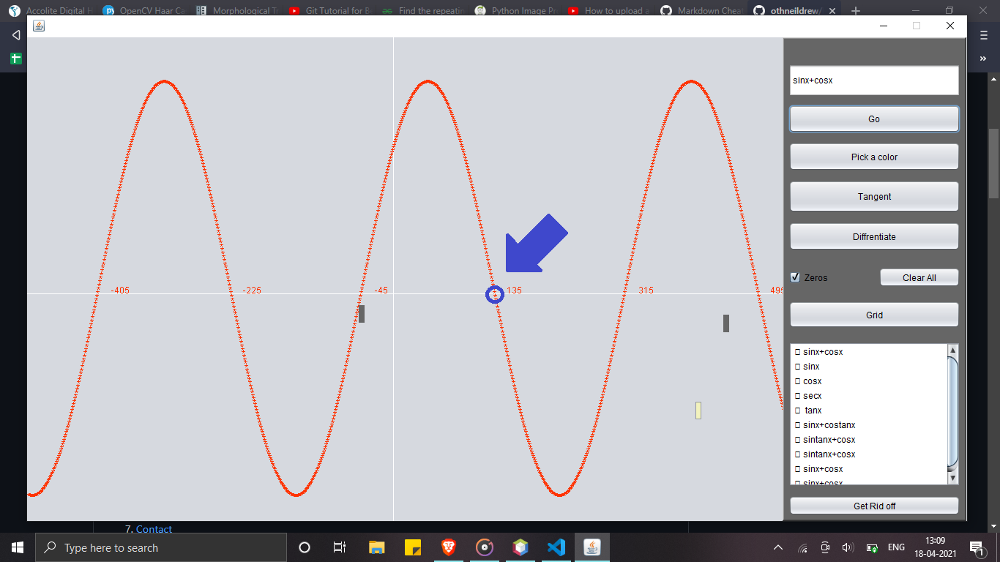
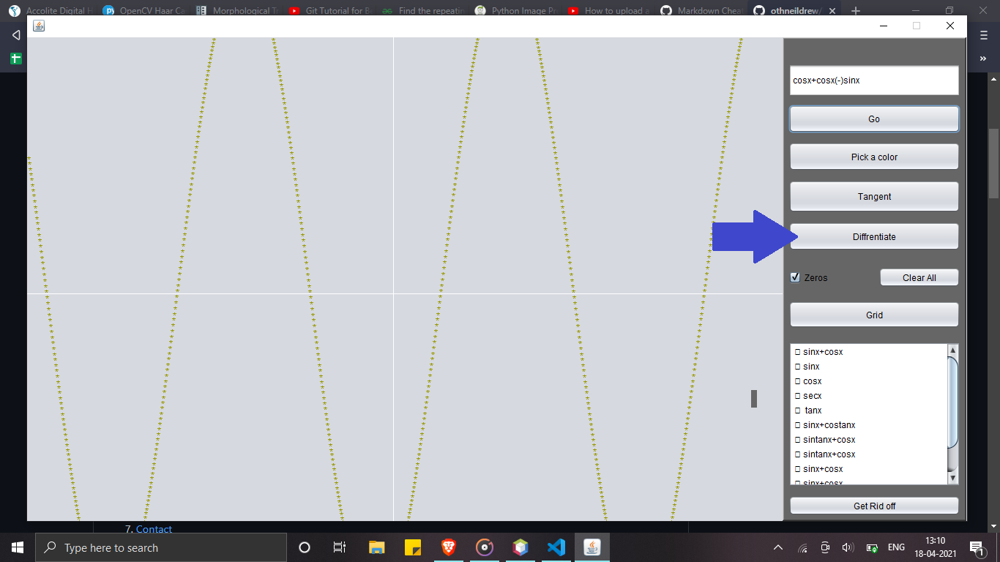

# Equation-Plotter

## Overview

This a Java based program which plots the trignometric equation and have features like

* Plot the graph with animation
* Colour Picker
* Finding Zeros
* Diffrentiating the given equation

## Main Page

This is the front page. Let's see the magic...

## Plotting the Equation

Put the trignometric equation and click GO button and the see the magic

Oh! it also lists your all equation to study your equation

## Colour Picker

Very Confused to study your different equations? Let's pick the colour here,

## Finding Zeros

Never thought that getting zeros would be this much difficult :smile:

## Diffrentiate the Equation

Having difficulty in diffrentiation? Let me make your work easier

